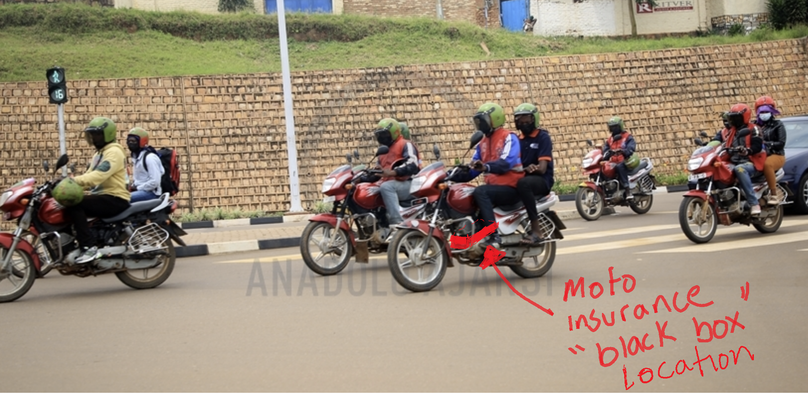
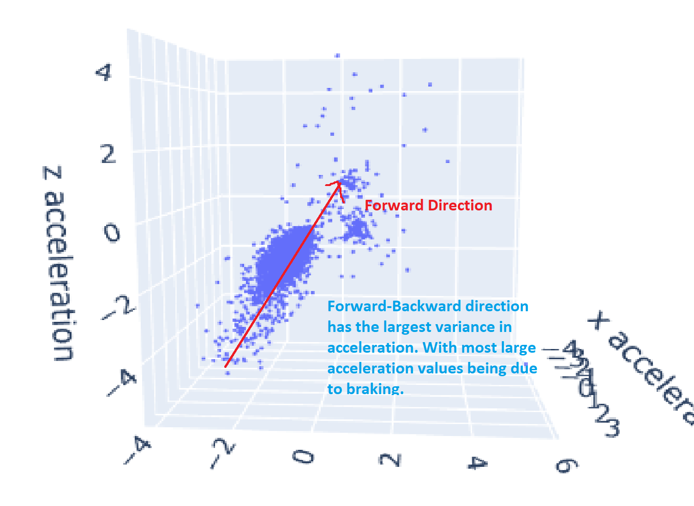
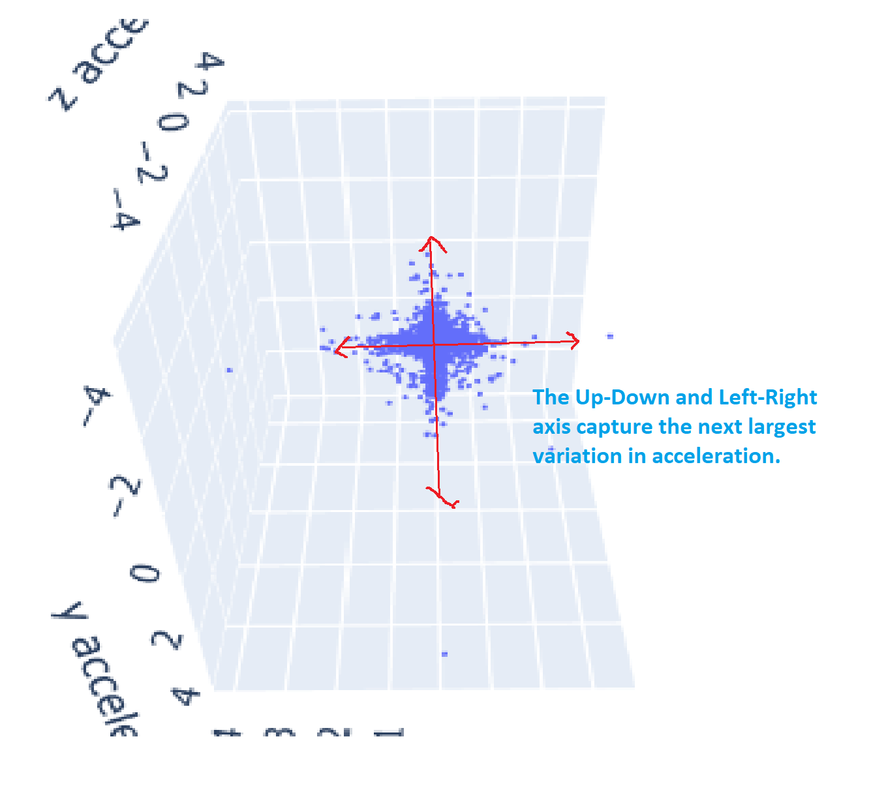
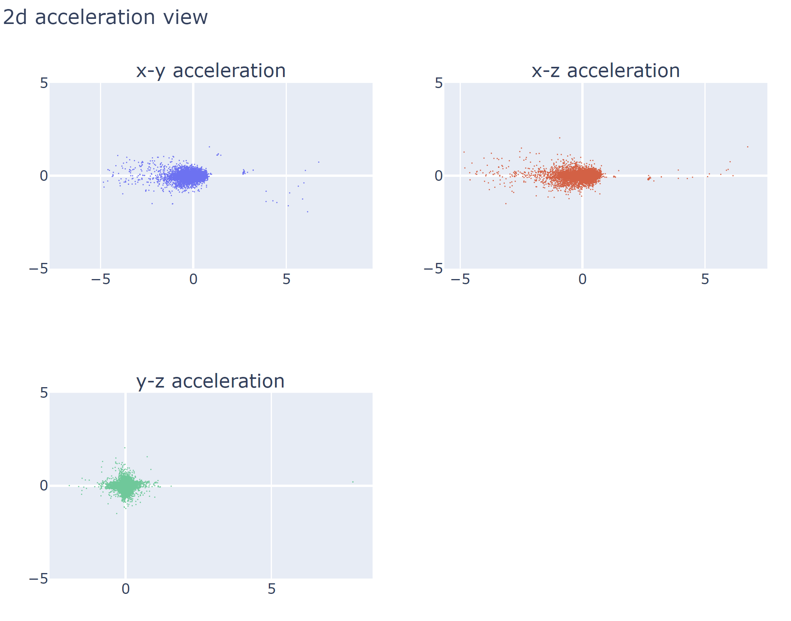
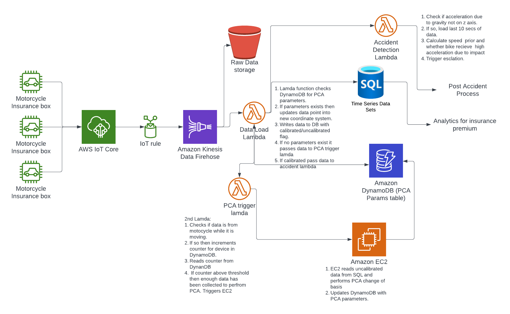

# Principle Component Analysis for Detecting Motorcycle Accidents
<p align="center">
  
</p>


This notebook highlights an interesting solution I discovered when working on a professional project to automatically detect motorcycle collisions with an insurance black box. The solution was developed for a company delivering solutions for East Africa where motorcycles transport is the most common form of transportation.

I have permission to share these results. Although much of the work I completed is deemed intellectual property so I'm only including a small subsection. 

## The problem

> Automatically calibrate the insurance box without physical intervention in order to automatically detect when a motorcycle has an accident.

Once the devices are calibrated, detection of accidents are trivial. We just need to know when the bike is on it's side. In particular we just need to know when acceleration due to gravity is no longer downwards.


## Context for the problem

Insurance black boxes were designed for cars. Retrofitting them on to motorcycles means the inbuilt algorithms have to be modified. In particular:

- Devices have to fitted at awkward angles. This was throwing off the device calibration (i.e. the device does not know which way is forward)
- The devices are placed close to the engine. This means vibration from the engine presents itself as significant noise to the accelerometer.
- Motorcycles are much more bumpy then cars.

The insurance boxes have two sensors:

- GPS 
- Accelerometer

Notetably there is no gyroscope (you don't need one in a car!). The sensors store information locally at 1 second intervals and then push to an AWS SQL database whenever a mobile internet connection can be established.



Hopefully my expertly drawn addition helps with understanding where these boxes are located on motorcycles.

## Wider context

Motor vehicle accidents are a major problem in East Africa. Motorcycle taxis are a the main form of transport for most of the population.

Table below shows that motor vehicle deaths per 100,000 inhabitants are globally highest in Africa. The system being designed will be able to alert emergency services when a moto-taxi has had a serious collision.

| Country/region        |   Deaths per 100k/year |
|:----------------------|-----------------------:|
| Africa                |                   26.6 |
| South-East Asia       |                   20.7 |
| Global                |                   18.2 |
| Eastern Mediterranean |                   18   |
| Western Pacific       |                   16.9 |
| Americas              |                   15.6 |
| Europe                |                    9.3 |

[wiki source](https://en.wikipedia.org/wiki/List_of_countries_by_traffic-related_death_rate)

Kenya is particularly bad globally with 29.1 deaths per 100k inhabitants per year. Which means each year you have a 0.0291% chance of dying in a vehicle accident (Interesting fact: Obama's dad died in a car collision in Kenya). 

| Country/region   | Continent   |   Deaths per 100k/year |   Percentile |
|:-----------------|:------------|-----------------------:|-------------:|
| Kenya            | Africa      |                   29.1 |     0.936508 |


# The data

Below is a few rows and important columns from the dataset.

| device.name   |   timestamp |   x.acceleration |   y.acceleration |   z.acceleration | engine.ignition.status.1   |
|:--------------|------------:|-----------------:|-----------------:|-----------------:|:---------------------------|
| Bike 07       | 1.65662e+09 |            0.236 |           -0.241 |           -0.128 | False                      |
| Bike 07       | 1.65662e+09 |            0.236 |           -0.241 |           -0.128 | False                      |
| Bike 07       | 1.65662e+09 |            0.132 |            0.067 |           -0.03  | True                       |
| Bike 07       | 1.65662e+09 |            0.146 |            0.097 |           -0.085 | True                       |
| Bike 07       | 1.65662e+09 |           -0.06  |            0.079 |            0.603 | True                       |'

This bike is uncalibrated so the x acceleration is not necessarily the forward acceleration. We need to change the coordinate system of the data points so the x acceleration is describing the acceleration in the forward direction. The interactive graph below shows the data points for a particular bike aligned offaxis.

 - There are no labels so we need to develop an unsupervised method to automatically calibrate the device based on the data above.

 ## Visualizing the data

 

 Since the device is uncalibrated the forward acceleration does not move along the x-axis. Instead a forward movement is captured as a diagonal acceleration within the standard coordinate system. Since there are many different motorbike models each device will need to be automatically calibrated individually.

 # Formulating the calibration into PCA problem

 Principle component analysis is generally used as a dimension reduction technique. The data is projected onto a new dimension which is a linear combination of the existing features. The first principle component is a line which captures the largest range of variance within the dataset. The second principle component is a line orthogonal to the first which captures the next most range of variance and so on. The idea being you can reduce the number of features by using a new set of generated features which capture the majority of variance in the dataset. Ultimately, PCA is a change of basis. 

 Using the context of this problem we can apply PCA not to reduce the number of features but to use a robust technique to find a new coordinate system for our acceleration data. 

 Things we know:
 - The largest change (variance) in acceleration is from forward-backward movement (acceleration and braking).
 - Orthogonal to forward and backward movements are left-right and up-down.
 - The direction of gravity can be found when the is not moving.

 With the data and these three bits of information we can build a method to automatically calibrate the devices.

 Below I've tried to label the acceleration graph to highlight these points.

 

 

# Applying to the DataSet

The steps are relatively straightforward and well documented so I'll be brief:

1. Remove all data points for when the bike is stationary (as this includes when the bike at an angle on it's stand)
2. Centre the data
3. Apply the PCA algorithm
4. Use all three Principle Components to change the basis of the entire dataset.

The code for all of the above is in the MotorcycleAccidentSummary.ipynb notebook within this repository.

Once the data is centered applying PCA to the data is as simple. We are using 3 principle components with 3 dimensions of data so no information is lost.

```

from sklearn.decomposition import PCA

pca = PCA(n_components=3)
principalComponents = pca.fit_transform(bike_df_centered)

print(pca.components_)

[[-0.01534458  0.48943954  0.87190222]
 [ 0.03486902  0.87173642 -0.48873281]
 [-0.99927408  0.02290297 -0.0304427 ]]

```

The rows are the principle components in order. We can visualize these components on the original data by applying pca transform to the the standard co-ordinate axis.

```
axis_values = np.arange(-3,4)
zero_values = [0]*len(x_values)
x_axis = np.stack((axis_values, zero_values, zero_values), axis=-1)
y_axis = np.stack((zero_values, axis_values, zero_values), axis=-1)
z_axis = np.stack((zero_values,zero_values, axis_values), axis=-1)

# We transform the x,y,z axis into the new axis.
transformed_axis_x = pca.transform(x_axis)
transformed_axis_y = pca.transform(y_axis)
transformed_axis_z = pca.transform(z_axis) 

```

Plotting the transformed axis onto the uncalibrated data we see that the new basis lines well with our understanding the motorcycle


Now the only thing left to do is transform the data into it's new basis. This is done simply by applying the pca transform to the dataset.

```
transformed_df = pca.transform(bike_df_centered)

```

Now the acceleration data lines up correctly with the axis. 


I added a 2d view of each acceleration pair. The y-z acceleration view shows the data points are now lines up properly with the axis. 



There is still one more step left. From this analysis we cannot say for certain whether the y or z axis is up/down or left/right. For this we use data from when the bike is stationary and switched on. 

# Detecting accidents
Once the acceleration data is using the correct coordinate system a heuristic set of rules can be used to detect whether an accident has occurred. I will outline this briefly.

1. Check if acceleration due to gravity is no longer working on the z axis.
2. If so, load previous data and check speed and/or if bike suddenly slowed down prior to change in gravity.
3. If accident is suspected then trigger further processes.

# Implementing on AWS

Implementing this on cloud infrastructure requires a few steps:

1. Before this algorithm can be implemented enough data points of the motorcycle moving need to be collected.
2. Once enough is collected the new coordinate system can be calculated.
3. Acceleration data points need to be transformed into the new coordinate system.

Transforming the incoming data points into new coordinate system is simply a matrix multiplication of the calculated PCA components. Below I sketched out a simple AWS implementation.




